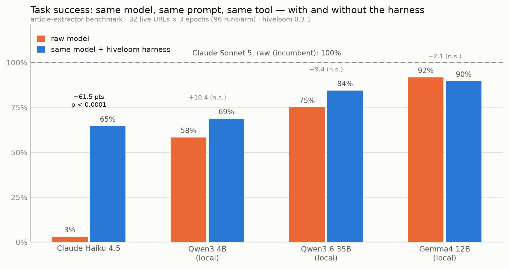
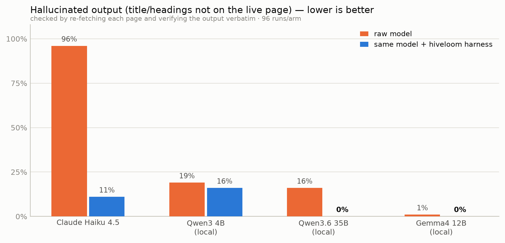
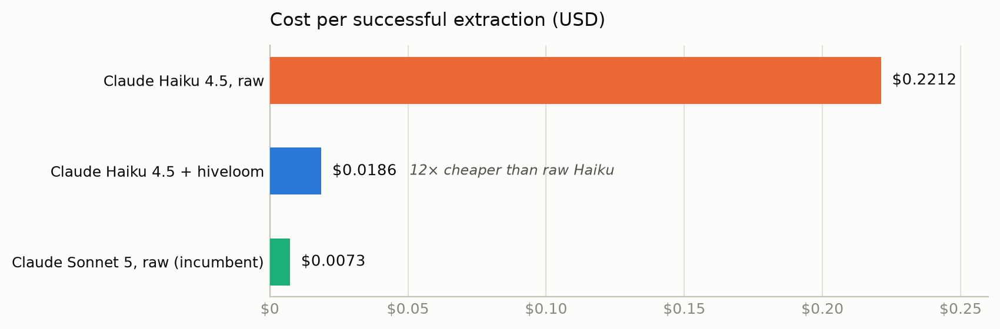
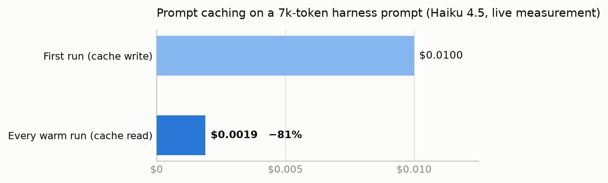

# hiveloom

[](https://github.com/FrancescoMrn/hiveloom/actions/workflows/ci.yml)
[](https://github.com/FrancescoMrn/hiveloom/releases/latest)
[](pyproject.toml)
[](LICENSE)

**Build durable agent harnesses so smaller models can perform repeatable,
verifiable tasks.**

A model is only one part of an agent. Tools, context, loop policy, guardrails,
and verification often decide whether the same model succeeds or fails.
hiveloom makes that surrounding system a self-contained folder that can be
validated, versioned, run anywhere, measured, and deliberately improved.



Same model, same prompt, same tool — the only difference is the harness. Claude
Haiku goes from 3% to 65%; the three local models move by amounts that are noise
at this sample size, and one is slightly worse. Which is the point:
[the evidence is measured per task and model](#measured-performance), not
assumed.

> **Status:** `0.5.0`. The spec, CLI, Python SDK, runtime, trace/Hive
> memory, generation, gated evolution, packaging, MCP integration, and HTTP
> serving surfaces are implemented, along with playbooks, structured
> artifacts, run control, and session-grouped traces.

## The moat: Your harness is the product

- **A durable artifact:** `harness.yaml` and its code hooks replace fragile,
  conversation-only setup.
- **One validated construction path:** CLI edits and model-generated plans use
  the same transactional API; invalid changes roll back.
- **Closed-loop evidence:** every run produces a version-hashed trace, so
  `stats` can show whether a harness change improved success, cost, or turns.
- **Safety outside the model:** cost limits, tool allowlists, redaction,
  verification, and frozen evolution fields are enforced in code.
- **Open and portable:** builtins, extension packs, custom providers, and MCP
  tools share one runtime contract; a harness remains a normal folder.

The *hive* is the collective memory of runs. The *loom* turns task intent and
that evidence into an improvable harness.

## Measured performance

Three checked-in evaluations live in [`evals/`](evals/README.md), each with its
harnesses, scoring code, and committed results. They answer three different
questions, and the answers are not the same.

### 1. Does a harness rescue a weak model? (article-extractor)

The [article-extractor benchmark](evals/article-extractor/RESULTS.md) evaluates 32
live URLs over three epochs (96 runs per arm). Raw and harness arms use the same
prompt and fetch tool; the difference is the harness scaffolding.

| Model / arm | Task success | Hallucination | Cost per success | p50 latency |
|---|---:|---:|---:|---:|
| Claude Haiku 4.5, raw | 3% | 96% | $0.2212 | 5.8s |
| Claude Haiku 4.5 + hiveloom | **65%** | **11%** | **$0.0186** | 10.3s |
| Claude Sonnet 5, raw baseline | 100% | 0% | $0.0073 | 6.4s |
| Qwen 3 4B, raw / harness | 58% / **69%** | 19% / 16% | local | 3.9s / 6.3s |
| Qwen 3.6 35B, raw / harness | 75% / **84%** | 16% / **0%** | local | 13.5s / 16.4s |
| Gemma 4 12B, raw / harness | **92%** / 90% | 1% / **0%** | local | 26.2s / 9.3s |

The Haiku harness gained 61.5 percentage points over raw Haiku and cut cost per
successful result by 12×. Read the rest of the table before generalising from
that: **Haiku's is the only delta that survives a paired test over the 32 URLs**
(p < 0.0001); the three local models move by 10 points or less, which is noise
at this sample size, and Gemma is slightly worse harnessed. Scaffolding rescues
a model that cannot hold the output contract. It does not improve one that
already can — and it did not beat raw Sonnet, which wins outright on both
success and cost.

Hallucination is the more robust signal, because the effect sizes are large
relative to the sample. Every output is checked verbatim against a re-fetch of
the live page:





### 2. Does it still earn its place on frontier models? (article-digest)

[article-digest](evals/article-digest/RESULTS.md) runs an output-heavy task —
a 120-200 word original summary plus five verbatim quotes and a verbatim
outline — on Claude Opus 5 and Sonnet 5. Both arms go through hiveloom with the
same prompt, tool, guardrails, and loop policy; the raw arms only drop the
validators and `loop.require_verification`, so the measured delta is
**validators plus retry-with-feedback, and nothing else**.

| Arm | Success | Hallucinated quotes | Cost per success |
|---|---:|---:|---:|
| Opus 5 + hiveloom | **100%** | 0% | $0.0383 |
| Opus 5, raw | 80% | 0% | $0.0320 |
| Sonnet 5 + hiveloom | **100%** | 0% | $0.0142 |
| Sonnet 5, raw | 80% | 0% | $0.0141 |

Neither model fabricated anything. What the raw arms lost was the *contract*:
one run emitted invalid JSON, another a quote outside the required length. The
harness is not buying accuracy from a frontier model — it is buying the tail
of contract compliance, at roughly unchanged cost per success.

### 3. What do frontier models still get wrong? (page-audit)

[page-audit](evals/page-audit/RESULTS.md) targets what remains: exhaustiveness
past a truncated tool view, aggregation, and date arithmetic. The fetch tool
clips its digest, and half the pages have more headings than the digest shows,
so no complete answer is reachable from the tool alone. The metric that matters
is not success but whether a wrong answer arrives **labelled**.

| Arm | Silently wrong | Flagged (`verify_failed`) |
|---|---:|---:|
| Opus 5 + hiveloom | **0/6** | 1/6 |
| Opus 5, raw | 5/6 | 0/6 |
| Sonnet 5 + hiveloom | **0/6** | 1/6 |
| Sonnet 5, raw | 3/6 | 0/6 |

Raw arms confidently returned truncated heading lists and off-by-one day
counts. The harnessed arms either recovered on retry or exited `verify_failed`
— they never returned a wrong audit as a success. That is the property a
downstream automation can actually build on.

Prompt caching (on by default for the `claude` provider) compounds this: in a
live measurement on a 7k-token harness prompt (Haiku 4.5, two-turn run), the
first run wrote the prefix to cache and every later run inside the cache TTL
read it back at a tenth of the input price — **$0.0019 per warm run vs $0.0100
cold, an 81% reduction**. A harness runs the same prompt shape every time,
which is exactly the workload prompt caching rewards.



That is the point of versioned evals: harness value is measured per task and
model, not assumed — it can be a rescue, a compliance floor, or nothing at all.
Sample sizes, scoring code, and caveats are in
[`evals/README.md`](evals/README.md).

## Install

```bash
uv pip install hiveloom
# or: pip install hiveloom
```

For development:

```bash
git clone https://github.com/FrancescoMrn/hiveloom.git
cd hiveloom
uv sync --extra dev
```

## Five-minute quickstart

```bash
# Explore the contract without an API call
hiveloom schema --annotated
hiveloom catalog tools

# Construct a harness; every mutation validates and rolls back on error
hiveloom init ./summarizer --name summarizer \
  --task "Summarize a text file into JSON."
printf '%s\n' "The quick brown fox jumps over the lazy dog." \
  > ./summarizer/notes.txt
hiveloom add tool --builtin file_read --dir ./summarizer
hiveloom add validator --builtin regex_match --pattern '"summary"' \
  --dir ./summarizer
hiveloom validate ./summarizer --json

# Assemble the first call without contacting the model
hiveloom run ./summarizer --input notes.txt --dry-run --json

# Run for real (the default provider uses Anthropic)
export ANTHROPIC_API_KEY=sk-...
hiveloom run ./summarizer --input notes.txt --json

# …or any other lab. `hiveloom models` lists every provider and its key
# variable; OpenAI, Gemini, Mistral, DeepSeek, xAI, Groq, OpenRouter,
# Together, Fireworks, Ollama, and vLLM are builtin.
hiveloom models
hiveloom set model openai/gpt-4.1-mini --dir ./summarizer

# Inspect evidence and propose a gated improvement after failures
hiveloom stats ./summarizer --json
hiveloom evolve ./summarizer --propose --json
```

Prefer model-driven construction?

```bash
hiveloom generate "Summarize a text file into JSON." -o ./summarizer --json
```

A complete credential-free example is in
[`harnesses/example-summarizer`](harnesses/example-summarizer).

## A harness is a folder

```text
my-harness/
├── harness.yaml          # declarative runtime contract
├── tools/                # optional code tools
├── validators/           # optional task-specific verification
├── schemas/
├── skills/
├── .hiveloom/traces/     # append-only run memory
├── .env.example
└── requirements.txt
```

Do not hand-edit `harness.yaml`; use `init`, `add`, `set`, `remove`, or the
gated `evolve` flow.

## Core interfaces

Every CLI command supports `--json`. Exit codes are stable:
`0` success, `1` verification failed, `2` guardrail halt, `3` invalid spec or
request, and `4` runtime failure.

```bash
# Explore and construct
hiveloom schema --json
hiveloom explain context.compaction --json
hiveloom catalog validators --json
hiveloom set loop.max_turns 20 --dir ./my-harness --json
hiveloom add tool --builtin file_read --dir ./my-harness --json

# Run and inspect
hiveloom run ./my-harness --input input.txt --stream
hiveloom trace <run-id> --json
hiveloom stats ./my-harness --json

# Improve with a human gate
hiveloom evolve ./my-harness --propose --json
hiveloom proposals list ./my-harness --json
hiveloom proposals apply ./my-harness <proposal-id> --json

# Extend and ship
hiveloom extensions --json
hiveloom mcp list-tools --dir ./my-harness --json
hiveloom package ./my-harness --docker --json
hiveloom serve ./my-harness
hiveloom mcp serve ./my-harness ./other-harness
```

`run --dry-run` makes no model call, but declared MCP servers are contacted
because their tools are discovered eagerly. `serve` provides `/healthz` and
`/runs`; the separately documented `control-plane` is a scoped,
bearer-authorized, non-production operational API.

`mcp serve` is the agent-facing front door: it exposes each harness as an MCP
tool (`run_<name>`) plus a `list_harnesses` tool that carries each harness's
measured success rate and cost, so any MCP-capable agent can pick a harness on
evidence and delegate a task to it — getting back a structured,
validator-checked result instead of improvising the task itself. Input is
always treated as literal text, and untrusted directories fail at startup
(approve them with `hiveloom trust`). Register harnesses once with
`hiveloom registry add <dir>` and serve them all with `--registered`; add
`--http` (with `HIVELOOM_API_KEY`) to serve over streamable HTTP instead of
stdio.

### Python SDK

The root package exposes the small semver-stable embedding surface:

```python
from hiveloom import (
    Hive,
    dry_run,
    generate_harness,
    load_spec,
    run_harness,
    validate_harness,
)

info = dry_run("./my-harness", "input.txt")
result = run_harness(
    "./my-harness",
    "input.txt",
    on_event=lambda event: print(event.type),
)
spec = generate_harness("Reconcile invoices", "./invoice-reconciler")
```

Inject a `ModelProvider` into `run_harness` or a `StrongModel` into
`generate_harness` for custom embedding and deterministic tests. For
language-neutral integration, use `run --stream` (JSONL) or `serve` (HTTP).

## Safety invariants

- Evolution cannot change `guardrails`, `model`, `logging.redact`,
  `extensions`, `hooks`, `mcp_servers`, or `evolution.auto_propose`.
- The cost guardrail defaults on at `$1.00`.
- The shell tool is disabled unless explicitly configured and remains
  allowlist-only.
- Redaction runs before trace persistence.
- Foreign harness code is trust-gated before loading.

## Documentation

- [Agent entry point](AGENTS.md) and [lifecycle skills](skills/README.md)
- [Evaluations](evals/README.md)
- [Harness spec](docs/spec.md)
- [Architecture](docs/architecture.md)
- [Models and providers](docs/models.md)
- [Extensions](docs/extending.md)
- [Deployment and evolution](docs/deploying-and-evolving.md)
- [Control plane](docs/control-plane.md)
- [Link/sync protocol](docs/sync-protocol.md)
- [Contributing and QA](CONTRIBUTING.md)
- [Code of conduct](CODE_OF_CONDUCT.md)
- [Security policy](SECURITY.md)

Agent guidance ships in the wheel: `hiveloom guide --list`.

Apache-2.0 licensed.
