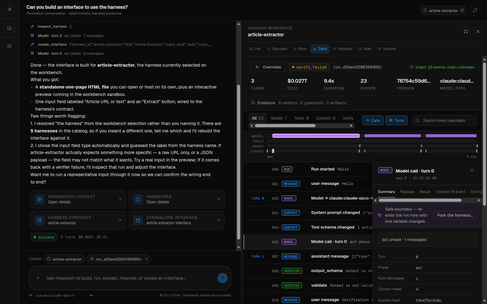
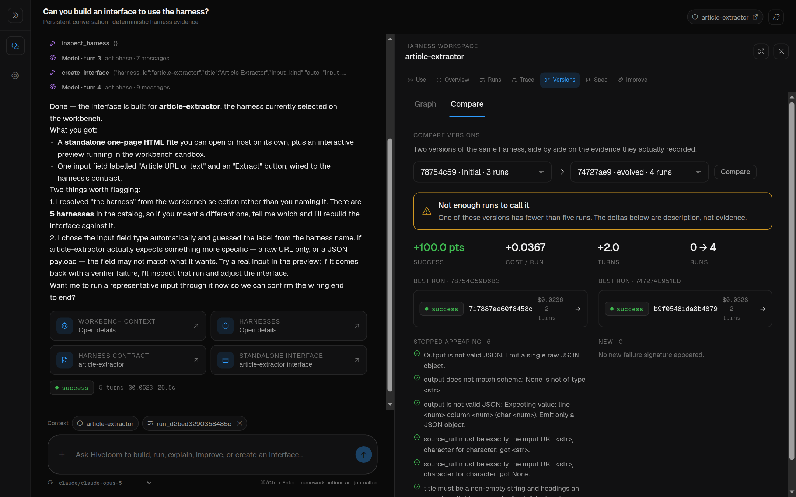
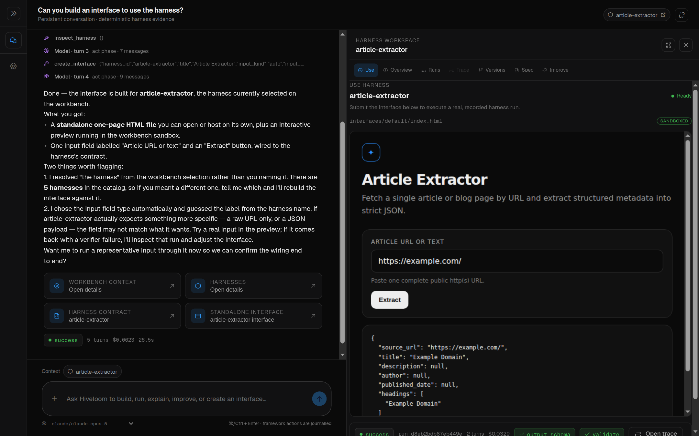

# The workbench

The workbench is hiveloom's development UI: a chat-first environment for
building, running, debugging, and improving harnesses **without first learning
the CLI or the specification language**. Everything the framework knows about a
harness — its spec, its runs, the full journal of any one of them, its version
history, its pending improvement proposals — is one click away, beside a
conversation with an agent that can act on all of it.

```sh
uv add hiveloom          # the framework your harnesses run on
npx hiveloom-workbench   # the inspector — fetched on demand, nothing to install
```

It opens on <http://127.0.0.1:8770>. `--host 0.0.0.0` when the browser is not on
this machine, `--port` to move it, `--dir` to offer one harness beyond the
registry, `--scan-dir` to discover a tree (`./harnesses` is picked up
automatically). State — conversations, memory, and the copilot's own working
copy — lives under `~/.hiveloom/workbench/`, which `HIVELOOM_HOME` relocates and
`HIVELOOM_UI_DB` overrides for the database alone.

**One package, three parts.** `npx` fetches a single npm package containing the
compiled interface, the Python API (`server.py` and the copilot harness), and a
Node launcher. The launcher finds the interpreter that has hiveloom — your
project's `uv` environment, an active virtualenv, or one it creates on demand —
starts the API on a private loopback port, and serves the interface in front of
it, proxying `/api` through. You get one URL and one origin; the API is not
reachable from anywhere else.

**Why the API is still Python.** Every action in the workbench validates a spec,
runs a harness, reads a journal, or drafts an evolution proposal. Those are
hiveloom's own modules. A JavaScript reimplementation would mean two versions of
the rules that decide whether foreign code is allowed to run, so the workbench
composes the real ones instead.

**Why it is not part of the `hiveloom` wheel.** The framework is what runs a
harness in production, on machines that will never open a browser. Shipping the
inspector separately keeps `uv add hiveloom` exactly as small for everyone who
does not want it, and `hiveloom ui` is a shortcut to the same `npx` command.

### From a checkout

Contributors run both halves with hot reload instead:

```sh
devtools/ui/dev.sh
#   workbench   http://127.0.0.1:5173
#   api         http://127.0.0.1:8770
```

The first launch installs the local npm dependencies. Ports move with
`HIVELOOM_UI_PORT` and `HIVELOOM_UI_API_PORT`, and harnesses come from the local
registry plus a recursive scan of this checkout's `harnesses/`. A checkout keeps
its state in `devtools/ui/.hiveloom/` rather than under `~/.hiveloom`, so
development never writes into the directory an installed workbench uses.


## One conversation, and evidence beside it

There is one primary interaction: a conversation with the bundled
`hiveloom-copilot` harness — a framework expert with constrained tools for
creating, inspecting, validating, dry-running, executing, diagnosing,
measuring, and proposing improvements to *target* harnesses.

Target harnesses are **context, not alternate chat agents**. Selecting a harness
or run in the rail attaches it to the conversation. A target execution is always
a separate, journalled run owned by that target harness, so copilot reasoning
never pollutes the target's fitness data.

Chat stays the front door, but it is never the only route to a fact. Selecting a
harness opens its workspace beside the conversation, with seven tabs that show
the framework's exact state rather than the copilot's paraphrase of it:

| Tab | What it is |
|---|---|
| **Use** | the harness's generated interface — a real, runnable page |
| **Overview** | contract, model, tools, guardrails, verification at a glance |
| **Runs** | every recorded run, with outcome, cost, and turns |
| **Trace** | the complete journal: filters, integrity, payloads, context, timing, fork |
| **Versions** | the version graph, tags, and side-by-side comparison |
| **Spec** | the validated spec, editable through the same construction API |
| **Improve** | the evolution proposal queue and its human gate |

Opening a workspace collapses the navigation rail to an icon strip; drag the
divider (or focus it and use the arrow keys) to resize the evidence area.

Conversations are durable. Messages, artifacts, and the selected harness/run
live in a local SQLite database (`~/.hiveloom/workbench/workbench.db`, or
`devtools/ui/.hiveloom/workbench.db` from a checkout) ignored by
Git (`HIVELOOM_UI_DB` moves it). A browser refresh or an API restart resumes the
same conversation instead of opening an empty one.

Cross-conversation memory is separate and explicit. Global and harness-scoped
memories share that database, are inspectable and deletable under
**Settings → Memory**, and reach the copilot through `recall_memories`,
`remember_memory`, and `forget_memory`. The copilot is instructed to save only
requested or clearly durable preferences; ordinary conversation content is never
silently promoted into memory.

## The journal, readable

The Trace tab is the reason the workbench exists. A run's
[journal](journal.md) is long, structured, and nested — exactly the shape a
terminal is worst at.



It shows the ordered events with filters, the hash-chain **integrity result**,
each event's payload, the **folded context** at any model call (the exact
request that went to the provider), per-event timing, and the fork controls. A
completed run also exports: `GET /api/runs/{id}/export` returns the journal
bytes verbatim, because a re-serialisation would not verify against the hash
chain.

## Live runs are steerable

A run in flight is not a black box. The run stream opens with `run_accepted`
carrying a pre-allocated id, and that id addresses the run while it is still
going:

| Action | Endpoint |
|---|---|
| Stop | `POST /api/runs/{id}/stop` |
| Steer | `POST /api/runs/{id}/messages` (with `GET`, `PATCH`, `DELETE`) |
| Change model | `POST /api/runs/{id}/model` |
| Change mode | `POST /api/runs/{id}/playbook` |
| Fork | `POST /api/runs/{id}/fork` |

Steering messages are **addressable**: you can see the queue before the loop
drains it, and edit a message in place rather than re-queueing it, so a
correction cannot silently reorder what the agent is told. A playbook switch
goes through the mode's own `on_enter`/`on_exit` gates — an operator switch uses
the same door the model does, not a way around it — and the model is told,
because a mode change it cannot see is one it will misread.

Everything here is `RunControl` in `hiveloom.loop.control`, applied at the
loop's next turn boundary, where no model call or tool is in flight. The
workbench is a client of it, not a privileged path.

## Fork, compare, resume

The Versions tab puts two versions side by side with deltas and the failure
signatures that appeared or disappeared between them. The fork controls turn a
failed run into an experiment: pick a model call, name the fork, optionally
override the model, and resume it.



Forks are nested under the harness that contains them. Catalog rows carry
`root_path`, `is_fork`, and `parent_id`, and the rail groups by **containment**
rather than by name — so a renamed fork stays with its harness, and two
unrelated harnesses that share a name stay two harnesses. A fork's target name
is slug-checked and resolved beside its parent: a fork writes files, and a
browser must never choose where.

`POST /api/harnesses/{id}/resume` re-runs a fork from the journal point it was
created at.

## Improvement stays gated

The copilot may draft an improvement; **applying it is a distinct user action**.
The UI applies accepted YAML changes explicitly and leaves code changes
unapproved unless you select them — silence is a refusal, not consent. Frozen
safety fields remain protected by hiveloom's evolution gate, which the UI cannot
bypass because it goes through the same `construct` API everything else does.

## Generated interfaces

`create_interface` writes a dependency-free page to
`<harness>/interfaces/default/index.html` and returns the complete HTML as an
artifact. This is how a harness stops being a CLI invocation and becomes
something you can hand to someone.



The workbench previews it in an `allow-scripts` sandbox with a narrow message
bridge that can only run the artifact's named harness. URL and text contracts
send literal input; file contracts upload into the harness workspace and send
the resulting safe relative path. Preview executions use the normal streaming
runner, so progress, stop control, verification verdicts, cost, and run identity
stay visible, and a finished preview opens directly into the same recorded trace
the Runs view uses.

Select a harness and choose **Use**. Harnesses without an interface explain the
copilot request that creates one; afterwards the same selection opens the
runnable page directly. The generated page also works against the ordinary
non-streaming `/run` endpoint when hosted with a deployment — a direct file page
needs a deployment-provided upload bridge, which the workbench preview supplies
automatically.

## Safety and boundaries

- The bundled copilot is validated and trusted when the workbench starts.
- Foreign target harnesses keep the normal trust gate before their code runs.
- Harness creation goes through `hiveloom.construct`; every step validates, and
  a failed creation removes the incomplete directory.
- Builtin names come from the live catalog, never a UI-maintained copy.
- Uploads pass through hiveloom's safe-path containment and cannot enter
  `.hiveloom` or `.env`.
- The preview iframe receives no credentials and no direct framework object.
- Copilot selection is request-owned context, not a global, so concurrent chats
  do not leak their selected harness or run into one another.
- Credentials are inherited: a harness runs inside the API process, so its
  provider's key must be exported where `dev.sh` runs, or live in the harness's
  own `.env`.

## Tests

```sh
uv run pytest -q tests/test_devtools_ui.py
uv run ruff check devtools/ui/server.py devtools/ui/copilot/tools/workbench.py
npm run typecheck --prefix devtools/ui
npm test --prefix devtools/ui
npm run build --prefix devtools/ui

scripts/build_workbench.sh    # the release build, end to end

uv run hiveloom validate devtools/ui/copilot --json
uv run hiveloom run devtools/ui/copilot --input "inspect this harness" --dry-run --json
```
